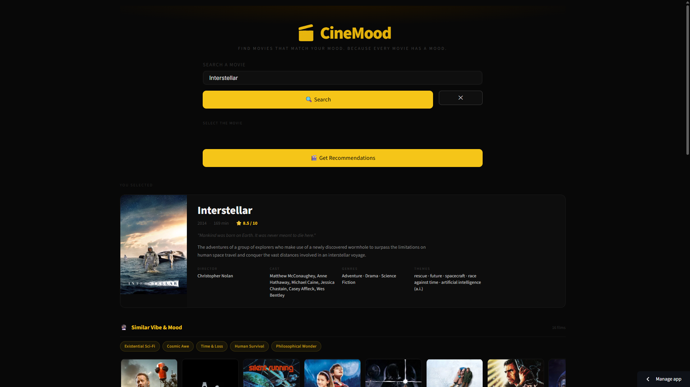
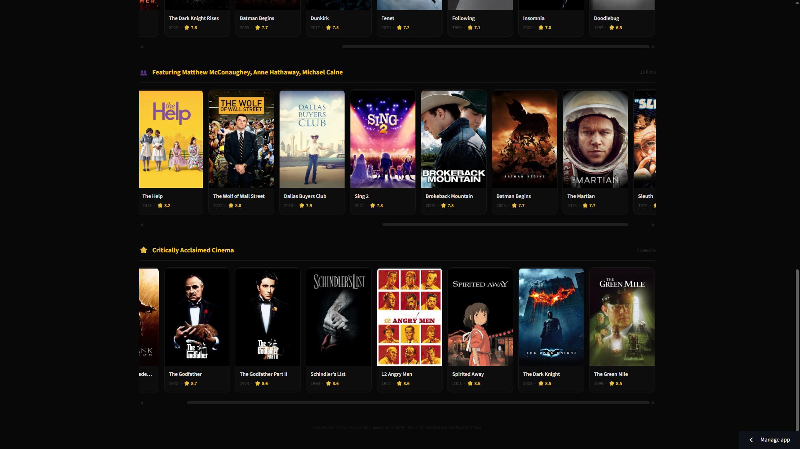
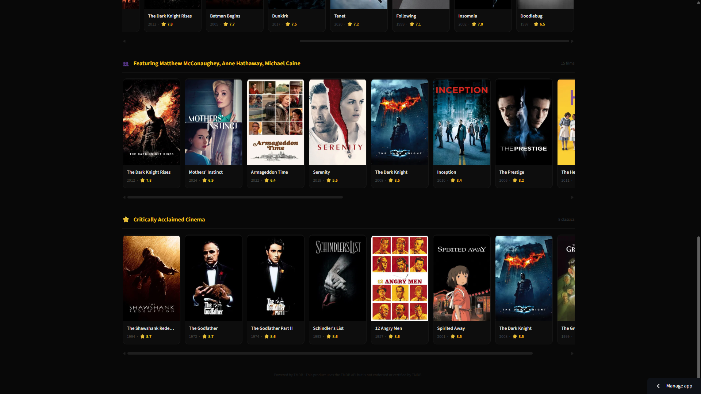
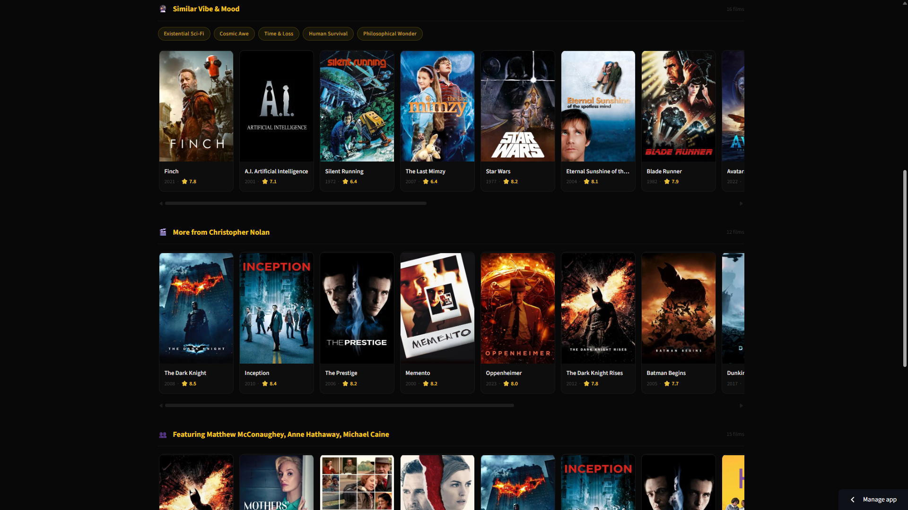

# 🎬 CineMood

> **Find movies that match your mood. Because every movie has a mood.**

[](https://rudytheacecoder18-cinemood-app-1r2wxf.streamlit.app/)
[](https://github.com/rudytheacecoder18/CineMood)

## 🌐 Live Demo

**[→ Launch CineMood](https://rudytheacecoder18-cinemood-app-1r2wxf.streamlit.app/)**

---

## What is CineMood?

CineMood is a **mood-based cinematic discovery platform**. Search any movie and get four intelligent recommendation categories — based on emotional tone, director, cast, and critical acclaim — all powered by live TMDB data.

Unlike generic recommenders that match by genre, CineMood understands the *cinematic feel* of a film. Search Fight Club and get Taxi Driver, Joker, and Nightcrawler — not random action movies — because they share themes of male alienation, identity crisis, and psychological descent.

---

## ✨ Features

| Feature | Description |
|---|---|
| 🔮 **Similar Vibe & Mood** | Films with the same emotional atmosphere and cinematic tone |
| 🎬 **Same Director** | The director's complete filmography, ranked by rating |
| 👥 **Shared Cast** | Films starring the same actors, ranked by overlap |
| ⭐ **Critically Acclaimed** | Verified classics at the same quality tier |
| 🎡 **Genre Wheel** | Spin to discover top films in any genre |
| 🏷️ **Mood Tags** | Thematic tags like "Male Alienation", "Psychological Descent" |
| 🎴 **Movie Cards** | Poster, year, rating, hover-to-reveal overview |

---
## 📸 Screenshots

### 🎬 Homepage & Search


### 🔮 Similar Vibe & Mood Recommendations


### 🎴 Cinematic Movie Cards


### ⭐ Critically Acclaimed Cinema


### 🌌 Interstellar Recommendation Example


---

## 🧠 How It Works

### The Curated Mood Layer (`moods.py`)
The core differentiator. Hand-picked mood profiles for ~30 iconic films map each title to films with the same *emotional* experience — not just genre. This is what makes Fight Club recommend Taxi Driver instead of random action films.

### Four Recommendation Engines

**🔮 Mood / Vibe** — Curated hand-picked films + TMDB recommendations + similar movies. Scored by genre overlap (50%), vote quality (30%), and popularity (20%).

**🎬 Director** — Full filmography via TMDB person credits, filtered by vote count, sorted by rating.

**👥 Actors** — Credits of top 4 billed cast, ranked by how many share the film, then by rating.

**⭐ Acclaimed** — High vote average + vote count ≥ 5,000. The floor prevents inflated scores from tiny audiences.

### Zero Local Dataset
Everything fetches live from TMDB. No CSV files, no stale data.

---

## 🛠️ Tech Stack

| Layer | Technology |
|---|---|
| Language | Python 3.10+ |
| UI | Streamlit |
| Data | TMDB API (live) |
| HTTP | `urllib` (Python built-in) |
| Caching | `@st.cache_data` |
| Deployment | Streamlit Cloud (free) |

---

## ⚙️ Run Locally

### 1. Clone
```bash
git clone https://github.com/rudytheacecoder18/CineMood.git
cd CineMood
```

### 2. Install
```bash
pip install -r requirements.txt
```

### 3. Get a free TMDB API key
Go to [themoviedb.org/settings/api](https://www.themoviedb.org/settings/api)

### 4. Create `.env`
```
TMDB_API_KEY=your_api_key_here
```

### 5. Run
```bash
streamlit run app.py
```

---

## 📂 Project Structure

```
CineMood/
├── app.py          → Streamlit UI, CSS, all layout
├── recommender.py  → 4 recommendation engines + genre wheel
├── tmdb_client.py  → TMDB API wrapper (urllib, retry logic)
├── moods.py        → Curated mood profiles for ~30 iconic films
├── requirements.txt
├── .env.example
├── .gitignore
├── .streamlit/
│   └── config.toml → Dark cinematic theme
└── README.md
```

---

## 📌 ML & Engineering Concepts

- Content-based filtering
- Multi-source candidate generation
- Weighted scoring & ranking
- Curated knowledge layer (cinematic mood ontology)
- Network fault tolerance (retry logic)
- Response caching with `@st.cache_data`

---

## 🚀 Deploy Your Own

1. Fork this repo
2. Go to [share.streamlit.io](https://share.streamlit.io)
3. Connect your fork → set main file to `app.py`
4. Add `TMDB_API_KEY = "your_key"` in Secrets
5. Deploy — live in ~2 minutes

---

## 🚀 Future Improvements

- OTT platform integration
- Expanded cinematic mood mappings
- Better explainable recommendations
- Enhanced mobile responsiveness
- More curated emotional recommendation layers
- Improved search experience and loading states

---

*This product uses the TMDB API but is not endorsed or certified by TMDB.*
